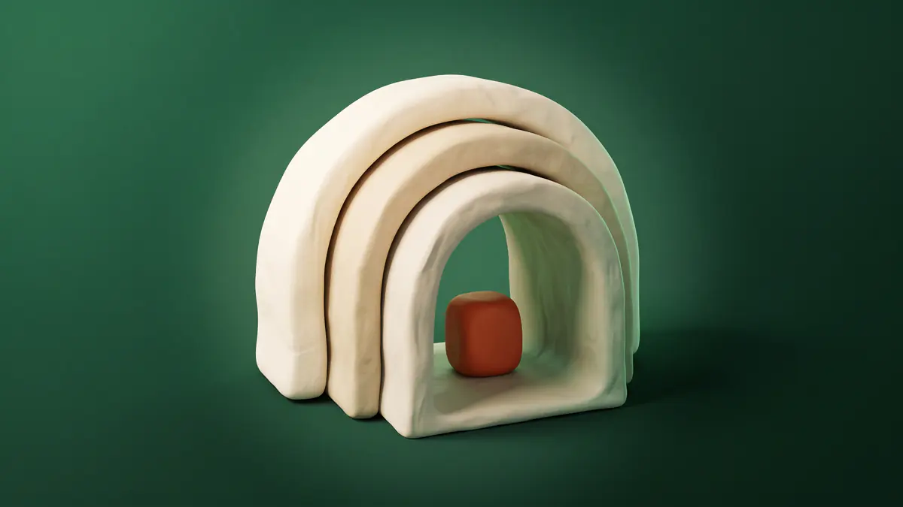

<p align="center">
  
</p>

# Product Discovery Tool

A guided buying flow for the Cactus shop. Shoppers pick what sort of thing they are after, then what sort of that, then what actually matters to them - and the products narrow as they go.

The difference between this and a filter panel is that every option here says what it means. "Cantilever" is explained in a sentence, "best for" and "worth knowing" sit under it, and a **Compare these** control puts the options side by side with your own words in the table. Somebody who does not know a cantilever frame from a panel end can still buy the right desk.

It runs entirely on the filters you already have, so nothing is set up twice.

## What a shopper sees

1. **What are you looking for?** Cards for the first level of your tree, each with a square picture, a line about it, and how many products are behind it. They lift on hover the way the product cards later in the flow do. "What is this?" appears only where you have written an explanation, and the block decides whether this first step offers "Compare these" and "Not sure yet" at all.
2. **Which sort?** The same again, one level down. A branch with nothing under it goes straight to the products - the step count follows the branch, so one route can be two steps and another three.
3. **What matters to you?** The products are already on screen. Questions run down the side, the important ones open and the rest under "More options", and ticking narrows what is shown with no reload. The block will put them **across the top** of the products instead, where they arrive shut, as a row of controls above the grid - the same choice, worded the same way, as the filter grid's own. On a tablet or a phone both settings do the same thing: the questions sit behind a "Narrow down" bar, because a row of questions above the products is a wall between a phone and the shop.

Under each step's choices, those two buttons fill the gap at the end of the last row where there is one, and take a centred row of their own where there is not.

Along the way:

- a running summary of every answer, each one removable;
- an option that would leave nothing is shown greyed with the reason, never quietly dropped;
- if a combination reaches zero anyway, the nearest sets are offered - "6 without *Glass top*" - rather than a dead end;
- results open with the matching options already chosen, so nobody answers the same question twice;
- two or three results can be put side by side with the features the flow asked about as the rows;
- every answer is in the address, so back and forward work and a result set can be shared.

## What you set up

Everything lives on **Shop → Products → Product Discovery**, with four tabs.

- **Flow** builds the tree. Each choice gets a picture, a line, the long explanation, its "best for" and "worth knowing", and what it selects - a category, a collection, a tag, some filters, or a category *and* some filters. The live product count sits beside every choice as you build, so one that catches nothing is obvious straight away.
- **Questions** decides which filter groups the last step asks, in what order, worded how. Leave it alone and every group is asked anyway, under its own name.
- **Guidance** is the coverage screen: every option in your whole filter vocabulary, with a tick for the ones you have explained. It is also where a whole flow is downloaded as a file and uploaded again.
- **Insights** counts which options get picked, which never do, and where people leave. Counts only - no cookie, no visitor record, nothing that could identify anybody, so there is nothing to add to your cookie banner.

Behaviour switches (counts, comparisons, the never-a-dead-end rule, photo swapping) live on **Shop → Settings → Product Discovery**.

Each flow answers at its own address - `/find-your-desk` - with its own page title, description and share image, and its own designed page layout under **Design → Layouts**. The **Discovery: Guided Flow** block also drops on any ordinary page - a homepage, a category page - where its **Flow** setting picks which flow to run from a list. There is a **Discovery: Launcher** block too, for dropping shoppers into the middle of a flow from a category page or an email.

On a phone or tablet the last step's questions live in a drawer behind one "Narrow down" button. The block decides whether reaching that step opens the drawer or leaves the shopper on the products, and whether a question's options run side by side or one per line. There is no "see the products" button, because the products are already on screen and already up to date - closing the drawer is the X on it, or a tap outside.

A button at the end of a flow is entirely optional and blank by default. Fill in a label and an address and it appears; leave it and the products are the end of the flow, which is what most shops want.

## Requirements

- **Shop** 0.1.377 or later
- **Filters for Shop** 0.1.48 or later

Filters is a hard requirement rather than a nicety: its groups, filters and rules are the vocabulary the last step asks in, and all the matching is its code. There is no second set of filters to keep in step.

## Moving a flow between sites

The **Guidance** tab downloads a whole flow as a file and uploads one back. Everything in it is referenced by slug - a filter is `colour/oak`, a choice is its path `desks/height-adjustable` - so a file written against one shop is readable by a person and applicable to another.

Uploading is two steps on purpose. The check resolves every reference and tells you exactly what the file names that your shop has not got, and how much of your existing flow it would replace, before anything is written. There is a command-line twin for the same job:

```bash
node scripts/import-flow.mjs my-flow.json --dry-run
```

Same file, same checks, same code - read the dry run first.
